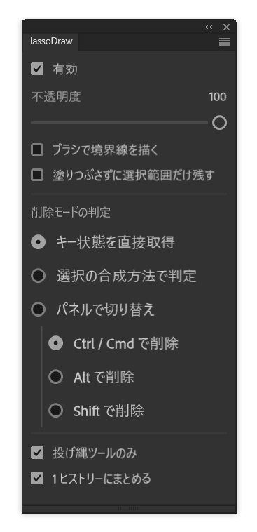

# lassoDraw

**English** | [日本語](README.ja.md)

A Photoshop UXP plugin that fills a lasso selection the moment you finish drawing it,
then deselects. Hold **Ctrl** while releasing the mouse and it erases instead.

Draw shape → it is painted. No `Alt+Backspace`, no `Ctrl+D`.



*The panel UI is Japanese only.*

---

## Features

- **Auto-fill** — every new lasso selection is filled with the foreground color and deselected
- **Ctrl to erase** — hold Ctrl (Cmd on macOS) as you finish the lasso to clear the area instead
- **Brush outline** — optionally stroke the selection border with your *current brush*
  (size, hardness, tip shape, scattering — all of it)
- **Selection-only mode** — skip painting and keep the selection, optionally grown by
  the exact area the brush would have covered
- **Toggle by keyboard shortcut** — via a bundled Photoshop script
- **Locked-layer aware** — skips operations Photoshop would refuse, so no dialogs interrupt you

## Requirements

- Photoshop 24.0 or later (UXP `manifestVersion` 5)
- ExtendScript enabled — still the case as of Photoshop 2026. It is used for modifier-key
  detection and for stroking the border; see [How it works](#how-it-works).
  Without it, the plugin still runs using the fallback detection mode.

> Developed and tested on Windows. macOS should work but is untested.

## Install

### As a plugin (.ccx)

1. Download `com.lassodraw.photoshop_PS.ccx` from this repository
   — the built package is committed alongside the source
2. Double-click it. The Creative Cloud desktop app installs the plugin.
3. In Photoshop: **Plugins > lassoDraw**

### For development

1. Install the [UXP Developer Tool](https://developer.adobe.com/photoshop/uxp/2022/guides/devtool/)
2. `Add Plugin...` → select this repository's `manifest.json`
3. With Photoshop running, click `Load`

## Usage

Pick a lasso tool and draw. That is the whole interaction.

| Action | Result |
| --- | --- |
| Lasso drag → release | Fill with foreground color → deselect |
| Lasso drag → **hold Ctrl** → release | Clear the area → deselect |

"Clear" is `Edit > Clear`: transparent on a normal layer, background color on a locked
Background layer.

> **Windows note**
> Holding Ctrl *before* starting the drag switches Photoshop to the Move tool.
> Start the drag first, then press Ctrl just before releasing the mouse.

### Panel options

| Option | Description |
| --- | --- |
| **有効 / Enabled** | Master on/off. Also on the panel flyout menu. |
| **不透明度 / Opacity** | Fill opacity, 1–100%. The color is always the foreground color. |
| **ブラシで境界線を描く / Stroke border with brush** | Also stroke the selection outline with the current brush. See [below](#stroke-border-with-brush). |
| **塗りつぶさずに選択範囲だけ残す / Selection only** | Paint nothing and keep the selection. See [below](#selection-only-mode). |
| **削除モードの判定 / Delete-mode detection** | How the plugin decides you want to erase. Three methods, see [below](#delete-mode-detection). |
| **投げ縄ツールのみ / Lasso tools only** | Turn off to also react to marquee, quick selection and magic wand. |
| **Ctrl+Z 一回で戻す / Single undo step** | Make one Ctrl+Z revert the whole operation, including the lasso selection itself. See [below](#one-step-undo). |

Settings are stored in `settings.json` inside the plugin's data folder.

### Stroke border with brush

Converts the selection to a work path and runs *Stroke Path* with the current brush.
Everything configured on the Brush tool is honoured. In erase mode the eraser is used
instead, so the outline behaves like the interior.

The selection has to be dropped before stroking — otherwise the brush is clipped by it and
only the inner half of the line is drawn. The plugin handles that and restores the selection
afterwards if needed.

### Selection-only mode

Nothing is painted; the selection stays active.

| Selection only | Stroke border | Plain lasso drag |
| :---: | :---: | --- |
| off | off | fill → deselect |
| off | on | fill + outline → deselect |
| **on** | off | nothing drawn, selection kept |
| **on** | **on** | nothing drawn, selection = **original ∪ area the brush would cover** |

The last row is useful for "select this shape, plus the margin my brush would add".

### Delete-mode detection

| Method | How it works |
| --- | --- |
| **Key state** (default) | Reads the real modifier-key state. Ctrl / Alt / Shift selectable. |
| **Selection combine mode** | Photoshop reports Shift and Alt lassos as different events (`addTo` / `subtractFrom`). Uses that instead. No ExtendScript needed. |
| **Panel toggle** | No modifier keys — flip fill/erase with a radio button. |

## Keyboard shortcut

UXP has no API for registering global keyboard shortcuts, so the plugin borrows
Photoshop's own "assign a shortcut to a script" mechanism.

1. Copy `scripts/lassoDraw Toggle.jsx` into Photoshop's scripts folder
   - Windows: `C:\Program Files\Adobe\Adobe Photoshop <year>\Presets\Scripts\`
   - macOS: `/Applications/Adobe Photoshop <year>/Presets/Scripts/`
2. Restart Photoshop. **File > Scripts > lassoDraw Toggle** appears.
3. **Edit > Keyboard Shortcuts** → *Application Menus* → **File > Scripts > lassoDraw Toggle**
   → assign a key.

The script itself does nothing. Photoshop broadcasts every script run as an
`AdobeScriptAutomation Scripts` action event carrying `javaScriptName`; the panel watches
for that name and flips its enabled state. Event-driven, no polling.

## How it works

Photoshop's UXP API cannot do several things this plugin needs. The workarounds are the
interesting part of this repository.

### Detecting a new selection

`action.addNotificationListener(["set", "addTo", "subtractFrom"], …)` watches the selection
channel. Notifications whose `to` is `{_enum: "ordinal"}` (deselect, select-all) are ignored,
which also prevents the plugin's own deselect from re-triggering it.

### Reading modifier keys

UXP exposes no global keyboard state — `photoshop.core` has no keyboard API and there is no
equivalent of ScriptUI's `keyboardState`. Only `event.ctrlKey` inside the panel's own UI is
available, which is useless while the canvas has focus.

ExtendScript *does* have it. The plugin generates a `.jsx` at runtime, runs it through
`batchPlay` and reads the result back from a file:

```
UXP ── batchPlay { _obj: "AdobeScriptAutomation Scripts", javascript: { _kind: "local", _path: token } }
     └── ExtendScript ── ScriptUI.environment.keyboardState
                      └── writes "ctrl,shift,alt,meta\n<timestamp>"
UXP ── reads the file back
```

The timestamp guards against stale reads; anything older than 5 seconds counts as a failure
and falls back to filling (never erasing) so a missed key press cannot destroy pixels.
The ExtendScript engine is slow on first use, so the plugin warms it up once at load.

### Stroking the border

`batchPlay`'s `{_obj: "stroke"}` is rejected inside an `executeAsModal` scope, returning
`{_obj: "error", message: "", result: -128}` — "user cancelled". Changing the tool id
(`paintbrushTool` / `brushTool` / `pencilTool`) makes no difference; the command itself is
refused. ExtendScript's `PathItem.strokePath()` has no such restriction, so the border goes
through the same bridge. There is no `batchPlay` fallback for this feature — it needs
ExtendScript.

### One-step undo

By the time the notification arrives, Photoshop has already committed the lasso's own
"Set Selection" history state. `suspendHistory` can only group what happens inside its
callback, so undoing would take two presses: one for the fill, one for the selection.

With **Ctrl+Z 一回で戻す** enabled, the plugin steps history back by one
(`{_obj: "select", _target: [{_ref: "historyState", _offset: -1}]}`) to swallow that state,
then recreates the selection from the shape carried in the notification descriptor — inside
the suspended scope. Selection, fill and deselect collapse into a single entry.

The outline is drawn *after* the suspended scope closes: ExtendScript path and brush
operations fail while history is suspended. So with **Stroke border with brush** enabled,
undo takes two steps rather than one.

Turn it off if you would rather keep the selection as its own history step.

### Measuring what the brush covers

There is no API that reports the footprint of a brush — softness, scattering and tip shape
only resolve when rasterized. So the plugin paints onto a **throwaway layer**, reads that
layer's opaque pixels as a selection, unions it with the work path, then deletes the layer.
Nothing is written to the artwork.

The temporary layer is created with ActionManager (`Mk` / `Lyr`) rather than
`doc.artLayers.add()`, because the latter inserts at the document root and would target the
wrong layer when the active layer sits inside a group.

### Not being interrupted by dialogs

Two separate causes, both fixed:

- `_options.dialogOptions` was `"dontDisplay"`, which per Adobe's docs *"is executed without
  UI unless an error occurs, or if the command needs additional parameters — in that case UI
  may be shown"*. On a transparency-locked layer the Fill command wanted the missing
  `preserveTransparency` parameter and popped its dialog. Now every command uses `"silent"`,
  which returns a scripting error instead, and `preserveTransparency` is passed explicitly.
- ExtendScript's `app.displayDialogs` defaults to `DialogModes.ERROR`, so errors are shown as
  dialogs even when `executeAction` is given `DialogModes.NO`. The generated scripts set it to
  `DialogModes.NO` and restore it afterwards.

### Locked layers

Operations Photoshop would refuse are skipped up front, with the reason logged to the console.

| Lock | Fill | Erase |
| --- | --- | --- |
| Lock all | skip | skip |
| Lock image pixels | skip | skip |
| Lock transparent pixels | run (opaque pixels only) | skip |
| Lock position | run | run |

Selection-only mode never touches the layer, so it works under any lock.

## Packaging

Use the UXP Developer Tool's **Package** action and save the result to the repository root.
It produces `<id>_PS.ccx`, which is the file users download — **repackage and commit it
whenever the source changes**, or a stale build ships stale code.

Hand-rolling the archive does not work in practice; package through the UXP Developer Tool.

A few notes on the format, in case packaging or installation fails:

- The archive is an unsigned ZIP with `manifest.json` at the root. UDT's
  `PluginPackageCommand` collects files with `ignore-walk`, honouring `.gitignore`, and skips
  dotfiles and existing `.ccx` files.
- The manifest is validated first, and Creative Cloud refuses to install with
  **error code -4** when the requirements are not met:
  - `version` in `x.y.z` form
  - `manifestVersion` ≥ 4
  - `host.minVersion` ≥ 22
  - an `icons` array at the top level
  - an `icons` array on every panel entrypoint

## Layout

```
manifest.json                 plugin definition
index.html / styles.css       panel UI
main.js                       event listening, batchPlay commands
extendscript.js               ExtendScript bridge (key state, border stroke)
icons/                        panel and plugin icons
scripts/lassoDraw Toggle.jsx  shortcut helper, goes in Photoshop's Presets/Scripts
docs/                         screenshots for this README
```

## License

Not yet chosen — see the repository owner.
